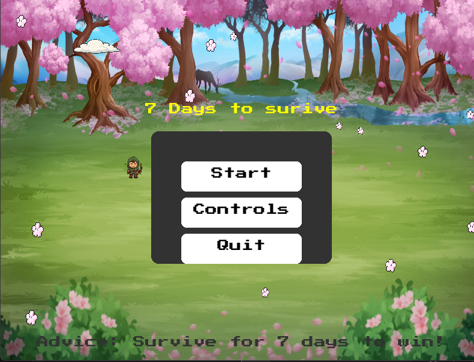

# 🌲 7 Days to Survive 🏹

A pixel-art 2D survival game built with Python and Pygame — now available as a standalone `.exe` file. Gather resources, fight off monsters, and survive through 7 in-game days while managing your health and hunger.


## 🎮 Gameplay Features

- 🌞 **Day/Night Cycle** with dynamic background music
- 🧟‍♂️ **Enemies** that spawn at night and chase the player
- 🪵 **Resource Gathering**: Collect wood, cook meat, and build walls
- 🎯 **Combat System**: Shoot arrows in four directions
- 🥩 **Inventory System**: Manage various types of meat
- 📅 **7-Day Goal**: Survive through 7 days to win the game

## 🕹️ Controls

| Key         | Action                      |
|-------------|-----------------------------|
| `WASD`      | Move                        |
| `Mouse Left`| Shoot Arrow                 |
| `F`         | Build wall (daytime only)   |
| `E`         | Collect wood from trees     |
| `1-4`       | Eat different types of meat |
| `B`         | Toggle Inventory            |
| `TAB`       | Show Controls               |

## 🛠️ How to Play

### ✅ Option 1: Use the `.exe` file (no setup required)

1. Download or clone this repository.
2. Locate the file: `7DaysToSurive.exe`
3. Make sure the `surival game/` folder (which contains all images, music, and fonts) is in the **same directory** as the `.exe` file.
4. **Double-click `7DaysToSurive.exe` to play**!

> ⚠️ Do not rename or move files from the `surival game/` folder or the game may crash.

---

### 💻 Option 2: Run from source (for developers)

1. Clone the repository:

   ```bash
   git clone https://github.com/AndyLiu0330/7-days-to-surive.git
   cd 7-days-to-surive
   ```

2. Install dependencies:

   ```bash
   pip install pygame
   ```

3. Run the game:

   ```bash
   python main.py
   ```

---

## 📁 Folder Structure

```
7-days-to-surive/
├── 7DaysToSurive.exe
├── main.py
├── surival game/
│   ├── img/
│   ├── mus/
│   └── PressStart2P-Regular.ttf
├── screenshots/
│   └── menu.png
└── README.md
```

## ✅ To-Do

- [ ] Add more enemy types and AI
- [ ] Save/load game progress
- [ ] Expand inventory with tools and crafting
- [ ] Add settings menu (volume, keybinds)

## 📸 Screenshots

> *(You can add more screenshots to the `screenshots/` folder and update these links)*

- **Main Menu**  
  

- *(Add gameplay screenshots like this):*  
  

---

## 👨‍💻 Author

**Andy Liu**  
GitHub: [@AndyLiu0330](https://github.com/AndyLiu0330)

---

Enjoy surviving the wild! 🌲🔥  
*“7 Days. One Chance. Can you make it?”*
